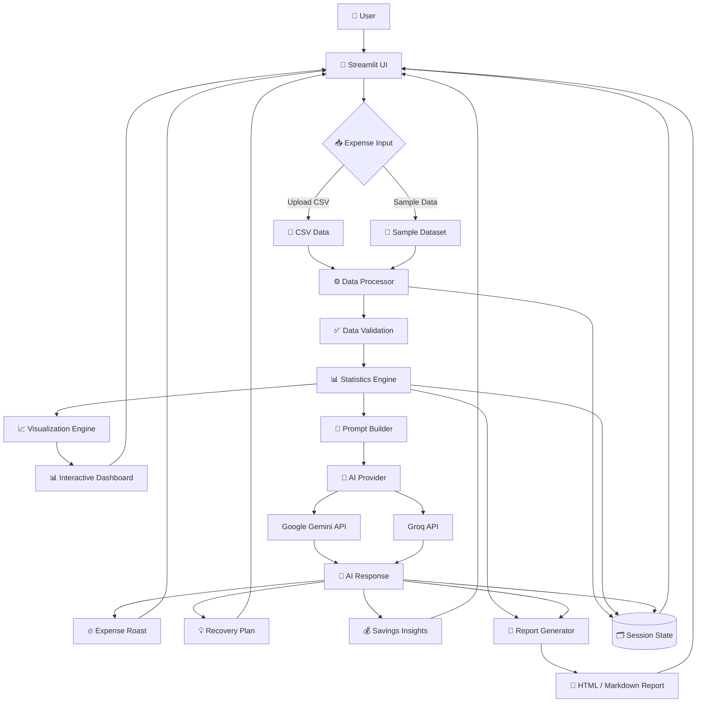
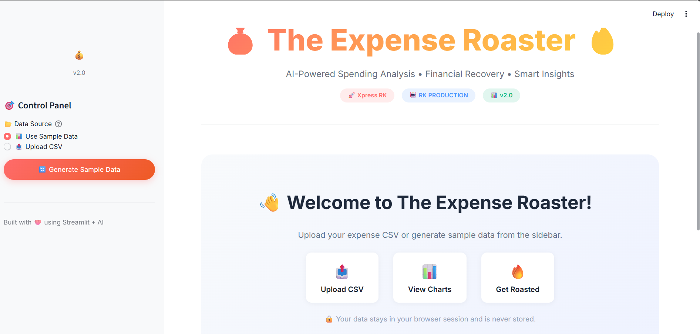
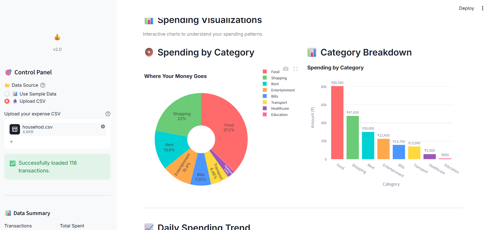
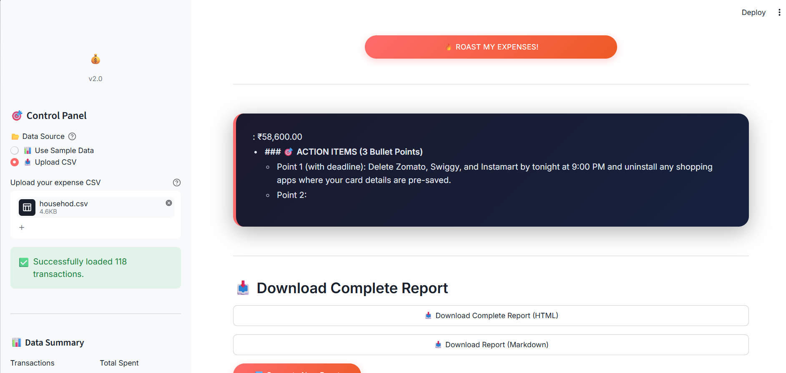
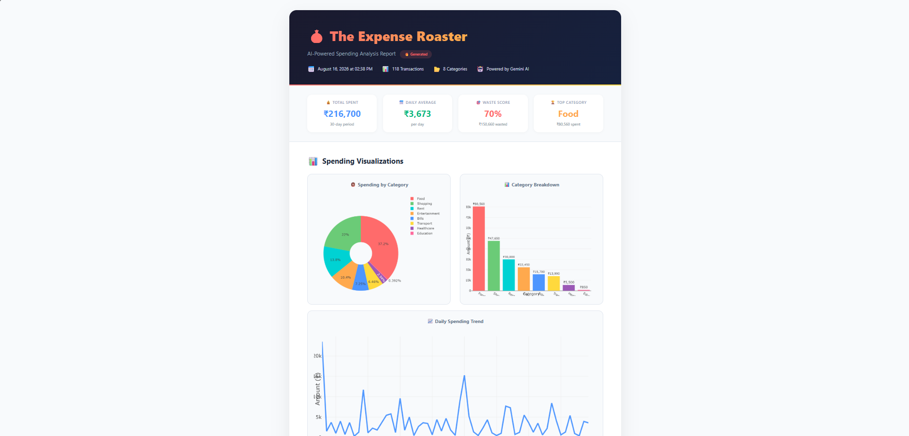

# 💰 The Expense Roaster 🔥

> **AI-Powered Personal Expense Analyzer & Financial Roast Dashboard**

# 💰 The Expense Roaster 🔥
<p align="left">
  <a href="https://www.python.org/">
    
  </a>
  <a href="https://streamlit.io/">
    
  </a>
  <a href="https://pandas.pydata.org/">
    
  </a>
  <a href="https://plotly.com/">
    
  </a>
  <a href="https://ai.google.dev/">
    
  </a>
  <a href="LICENSE">
    
  </a>
</p>

# 💰 The Expense Roaster 🔥

<!-- Badges here -->

## 🚀 Live Demo

🔗 **[Try The Expense Roaster Live](YOUR_STREAMLIT_DEPLOYMENT_URL)**

> Experience the AI-powered expense analysis dashboard directly in your browser.

**The Expense Roaster** is an AI-powered financial analytics application that turns raw expense data into **interactive visualizations, spending insights, personalized financial advice, and brutally honest AI-generated feedback.**

Instead of simply showing where your money went, the application uses AI to explain **why your spending patterns matter and what you can do to improve them.**

---

## 🚀 What Are We Building?

Managing expenses usually means looking at spreadsheets full of numbers.

The problem is:

* You can see how much you spent.
* You can see different categories.
* But you may not understand **your spending behavior**.
* You may not know **where you are wasting money**.
* You may not know **how much you could potentially save**.

### Our solution

We are building an intelligent expense analysis system that:

**Expense Data → Data Processing → Analytics → Visualization → AI Analysis → Financial Roast → Recovery Plan → Report**

The application combines traditional data analytics with Generative AI to provide a more understandable and engaging financial analysis experience.

---

# ✨ Key Features

### 📥 Expense Data Management

* Upload expense data through CSV files
* Generate sample expense data
* Edit expense records inside the application
* Support multiple expense records
* Validate and process uploaded data

### 📊 Interactive Financial Dashboard

The application calculates and displays important spending metrics such as:

* Total expenditure
* Average daily spending
* Category-wise spending
* Spending trends
* Potential waste patterns

### 📈 Data Visualization

Interactive Plotly visualizations help users understand their expenses:

* 🥧 Category-wise spending
* 📊 Category comparison
* 📈 Daily spending trends
* 💰 Spending summaries

### 🤖 AI Financial Analysis

The AI analyzes the processed expense information and generates:

* 🔥 Brutal spending roast
* 🧠 Spending behavior analysis
* 💡 Personalized recommendations
* 💰 Potential savings suggestions
* 📋 Recovery/action plan

### 📄 Report Generation

Users can generate downloadable reports containing:

* Expense statistics
* Visualizations
* AI-generated analysis
* Financial recommendations

---

# 🏗️ System Architecture



---

# 📸 Application Screenshots

### 🏠 Dashboard

The main dashboard provides an overview of the user's expense data, including key financial metrics and controls.



---

### 📊 Expense Visualizations

Interactive charts help users understand category-wise spending and daily expense trends.



---

### 🔥 AI Expense Roast

The AI analyzes the user's spending patterns and provides a brutally honest roast along with financial insights.



---

### 📄 Financial Report

Users can generate and download a structured report containing expense analytics, visualizations, and AI-generated recommendations.




# 🔄 How the System Works

### 1️⃣ User Provides Expense Data

The user can either upload a CSV file or generate sample expense data.

Example:

```csv
Date,Category,Description,Amount
2026-01-01,Food,Lunch,250
2026-01-01,Transport,Uber,180
2026-01-02,Food,Groceries,450
2026-01-02,Entertainment,Netflix,200
```

### 2️⃣ Data Processing

Python and Pandas process the uploaded data.

The system:

* Validates the input
* Converts dates
* Processes expense amounts
* Groups expenses by category
* Calculates spending statistics

### 3️⃣ Financial Analytics

The application calculates metrics such as:

```text
Total Spending
Average Daily Spending
Category Spending
Daily Spending
Spending Distribution
```

### 4️⃣ Visualization

The processed data is converted into interactive charts using Plotly.

This allows the user to visually identify:

* Highest spending categories
* Spending trends
* Unusual spending patterns
* Areas where money is being consumed

### 5️⃣ AI Analysis

The calculated financial information is passed to the AI through a carefully designed prompt.

The AI acts as **"The Expense Roaster"** and analyzes the user's spending behavior.

Instead of only saying:

> "You spent ₹8,000 on food."

It attempts to explain:

> **What the spending pattern means, why it may be problematic, and what the user can change.**

### 6️⃣ Recovery Plan

The AI generates practical recommendations based on the spending data.

For example:

```text
🔥 Roast:
Your food expenses are doing more cardio than you are.

📊 Problem:
Food represents 38% of your total monthly expenses.

💡 Recommendation:
Reduce restaurant orders and set a weekly food budget.

💰 Potential Impact:
Reducing food spending by 20% could significantly improve
your monthly savings.
```

### 7️⃣ Report Generation

The final analytics and AI insights can be combined into a downloadable report.

---

# 🧠 AI Architecture

The AI layer is designed to keep the application flexible.

```text
                ┌─────────────────┐
                │   Prompt Builder │
                └────────┬────────┘
                         │
                         ▼
                ┌─────────────────┐
                │  AI Provider     │
                │    Factory       │
                └────────┬────────┘
                         │
             ┌───────────┴───────────┐
             ▼                       ▼
      ┌──────────────┐        ┌──────────────┐
      │ Gemini API   │        │   Groq API   │
      └──────┬───────┘        └──────┬───────┘
             │                       │
             └───────────┬───────────┘
                         ▼
                 ┌───────────────┐
                 │ AI Response   │
                 └───────┬───────┘
                         ▼
                ┌─────────────────┐
                │ Response Parser │
                └─────────────────┘
```

This approach makes it possible to change the underlying AI provider without redesigning the complete application.

---

# 🛠️ Tech Stack

| Technology          | Purpose                    |
| ------------------- | -------------------------- |
| **Python**          | Core application logic     |
| **Streamlit**       | Web application & UI       |
| **Pandas**          | Expense data processing    |
| **NumPy**           | Numerical operations       |
| **Plotly**          | Interactive visualizations |
| **Google Gemini**   | Generative AI analysis     |
| **Groq**            | Alternative LLM provider   |
| **HTML / Markdown** | Report generation          |
| **Git & GitHub**    | Version control            |

---

# 📂 Project Structure

```text
expense-roaster/
│
├── app.py
├── requirements.txt
├── README.md
├── .gitignore
│
├── src/
│   ├── core/
│   │   ├── config.py
│   │   ├── constants.py
│   │   └── exceptions.py
│   │
│   ├── data/
│   │   ├── data_processor.py
│   │   ├── data_validator.py
│   │   └── mock_data.py
│   │
│   ├── ai/
│   │   ├── base_llm.py
│   │   ├── gemini_provider.py
│   │   ├── factory.py
│   │   ├── prompt_templates.py
│   │   └── response_parser.py
│   │
│   ├── ui/
│   │   ├── components.py
│   │   ├── dashboard.py
│   │   ├── visualizations.py
│   │   └── sidebar.py
│   │
│   ├── state/
│   │   └── session_state.py
│   │
│   └── utils/
│       ├── logger.py
│       ├── helpers.py
│       └── report_generator.py
│
├── tests/
│
└── .streamlit/
    └── secrets.toml
```

---

# 🚀 Getting Started

## 1. Clone the Repository

```bash
git clone YOUR_GITHUB_REPOSITORY_URL
cd expense-roaster
```

## 2. Create Virtual Environment

### Windows

```bash
python -m venv .venv
.venv\Scripts\activate
```

### macOS / Linux

```bash
python -m venv .venv
source .venv/bin/activate
```

## 3. Install Dependencies

```bash
pip install -r requirements.txt
```

## 4. Configure API Key

Create a `.env` file:

```env
GEMINI_API_KEY=your_api_key_here
```

Never commit API keys or secrets to GitHub.

## 5. Run the Application

```bash
streamlit run app.py
```

The application will open in your browser.

---

# 📊 Expected Input

The application expects expense data containing fields similar to:

| Column        | Description             | Example      |
| ------------- | ----------------------- | ------------ |
| `Date`        | Transaction date        | `2026-01-01` |
| `Category`    | Expense category        | `Food`       |
| `Description` | Transaction description | `Lunch`      |
| `Amount`      | Expense amount          | `250`        |

---

# 🎯 Project Goal

The main goal of **The Expense Roaster** is to demonstrate how **Generative AI + Data Analytics + Interactive Visualization** can be combined to create a practical financial intelligence application.

The project focuses on turning raw financial data into:

```text
Raw Expenses
      ↓
Structured Data
      ↓
Statistical Analysis
      ↓
Visual Insights
      ↓
AI Interpretation
      ↓
Personalized Recommendations
      ↓
Actionable Financial Plan
```

---

# 🔮 Future Improvements

Potential future improvements include:

* 📱 Mobile-friendly interface
* 🔐 User authentication
* 🗄️ Database integration
* 📅 Monthly and yearly financial comparisons
* 🎯 Personalized budget goals
* 🚨 Automatic unusual-spending detection
* 📧 Email report delivery
* 📊 Advanced financial forecasting
* 🤖 AI-powered budget planning
* ☁️ Cloud deployment
* 📈 Expense prediction using machine learning

---

# 👨‍💻 Author

## Rahul Kapade

**AI / Generative AI Developer | Student**

I'm interested in building practical applications using:

* Generative AI
* LLMs
* AI Agents
* Machine Learning
* LangChain
* Python
* Data Analytics

### Connect With Me

**GitHub:**
`https://github.com/Ra-32/`

**LinkedIn:**
`https://www.linkedin.com/in/rahul-kapade-1b5429385/`

---

# ⭐ Support

If you find this project interesting, consider giving the repository a ⭐ on GitHub.

---

## 📌 Project Summary

**The Expense Roaster** transforms a traditional expense tracker into an **AI-powered financial analysis assistant**.

It combines:

**Python + Pandas + Plotly + Streamlit + Generative AI**

to help users understand their spending, identify problematic patterns, receive personalized recommendations, and create actionable financial plans.

> **Don't just track your money. Understand it. Then let the AI roast you for wasting it. 🔥**
