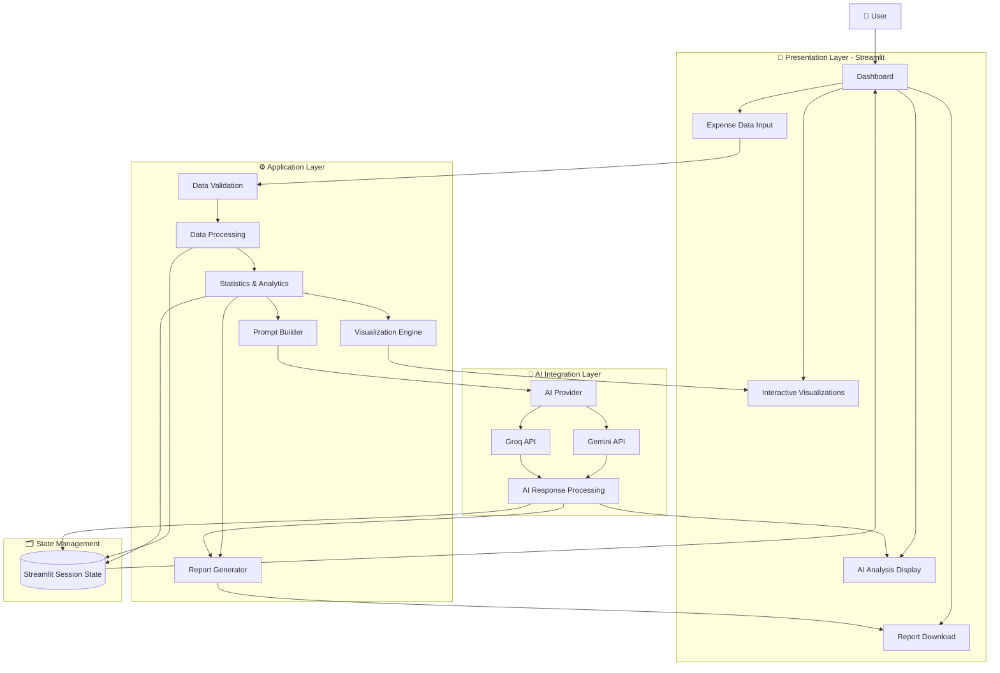
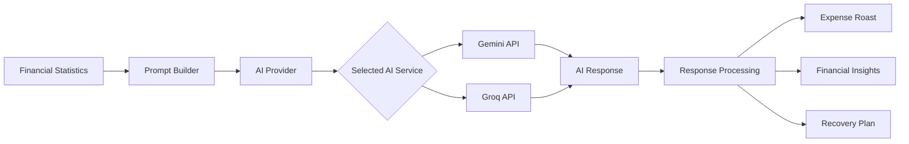
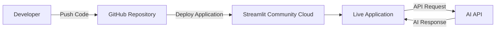

# 🏗️ System Architecture

## The Expense Roaster

**AI-Powered Expense Analysis and Financial Insights Dashboard**

**Author:** Rahul Ramkishan Kapade
**Project:** The Expense Roaster
**Architecture Type:** Layered Application Architecture
**Version:** 1.0.0
**Last Updated:** August 2026

---

## 📋 Table of Contents

1. [Overview](#1-overview)
2. [Architecture Overview](#2-architecture-overview)
3. [System Architecture Diagram](#3-system-architecture-diagram)
4. [Data Flow](#4-data-flow)
5. [Application Components](#5-application-components)
6. [AI Integration](#6-ai-integration)
7. [State Management](#7-state-management)
8. [Technology Stack](#8-technology-stack)
9. [Deployment Architecture](#9-deployment-architecture)
10. [Security Considerations](#10-security-considerations)
11. [Future Architecture Improvements](#11-future-architecture-improvements)

---

# 1. Overview

**The Expense Roaster** is an AI-powered financial analytics application designed to help users understand their spending habits.

The system accepts expense data, processes and analyzes it, generates interactive visualizations, and uses a Large Language Model (LLM) to provide personalized financial insights.

Unlike a traditional expense tracker that only displays numbers, The Expense Roaster transforms raw expense data into:

* 📊 Financial statistics
* 📈 Interactive visualizations
* 🔥 AI-generated expense analysis
* 💡 Personalized recommendations
* 💰 Potential savings insights
* 📄 Downloadable reports

The overall objective is to make financial data easier to understand by combining **data analytics, visualization, and Generative AI**.

---

# 2. Architecture Overview

The application follows a layered architecture with a clear separation between the user interface, data processing, analytics, AI integration, state management, and reporting.

```text
┌──────────────────────────────────────────────┐
│              PRESENTATION LAYER              │
│                                              │
│   Streamlit UI • Dashboard • Charts • Tabs   │
└───────────────────────┬──────────────────────┘
                        │
                        ▼
┌──────────────────────────────────────────────┐
│              APPLICATION LAYER               │
│                                              │
│ Data Validation • Processing • Analytics     │
│ Visualization • Report Generation            │
└───────────────────────┬──────────────────────┘
                        │
              ┌─────────┴─────────┐
              ▼                   ▼
┌──────────────────────┐  ┌──────────────────────┐
│    AI / LLM LAYER    │  │   STATE MANAGEMENT   │
│                      │  │                      │
│ Prompt Generation    │  │ st.session_state     │
│ AI Provider          │  │ User Data            │
│ Response Processing  │  │ Analysis Results     │
└──────────┬───────────┘  └──────────────────────┘
           │
           ▼
┌──────────────────────────────────────────────┐
│             EXTERNAL AI SERVICES             │
│                                              │
│         Gemini API / Groq API                │
└──────────────────────────────────────────────┘
```

---

# 3. System Architecture Diagram

The following diagram shows the high-level interaction between the user, application components, AI services, and reporting system.



---

# 4. Data Flow

The application processes user data through the following workflow:

```text
Expense Data
     │
     ▼
┌─────────────────┐
│ CSV Upload /    │
│ Sample Data     │
└────────┬────────┘
         │
         ▼
┌─────────────────┐
│ Data Validation │
└────────┬────────┘
         │
         ▼
┌─────────────────┐
│ Data Processing │
│ using Pandas    │
└────────┬────────┘
         │
         ▼
┌─────────────────┐
│ Financial       │
│ Analytics       │
└───────┬─────────┘
        │
        ├───────────────────┐
        ▼                   ▼
┌─────────────────┐  ┌─────────────────┐
│ Visualization   │  │ AI Prompt       │
│ Generation      │  │ Generation      │
└────────┬────────┘  └────────┬────────┘
         │                    │
         ▼                    ▼
┌─────────────────┐  ┌─────────────────┐
│ Plotly Charts   │  │ LLM API         │
└────────┬────────┘  └────────┬────────┘
         │                    │
         │                    ▼
         │            ┌─────────────────┐
         │            │ AI Response     │
         │            │ Processing      │
         │            └────────┬────────┘
         │                     │
         └────────────┬────────┘
                      ▼
              ┌───────────────┐
              │ Dashboard /   │
              │ Final Report  │
              └───────────────┘
```

---

# 5. Application Components

## 5.1 Presentation Layer

The presentation layer is built using **Streamlit**.

It provides the interface through which users interact with the application.

### Responsibilities

* Display the dashboard
* Accept CSV uploads
* Display financial metrics
* Render interactive charts
* Trigger AI analysis
* Display AI-generated insights
* Allow users to download reports

---

## 5.2 Data Processing Layer

The data processing layer is responsible for converting raw expense data into a structured format suitable for analysis.

### Main Operations

* Read CSV data
* Validate required columns
* Handle missing values
* Process dates
* Process expense amounts
* Group expenses by category
* Calculate financial metrics

### Example Input

```csv
Date,Category,Description,Amount
2026-01-01,Food,Lunch,250
2026-01-01,Transport,Uber,180
2026-01-02,Food,Groceries,450
```

### Example Processed Output

```text
Total Spending: ₹880

Category Breakdown:
Food: ₹700
Transport: ₹180

Highest Spending Category:
Food
```

---

## 5.3 Analytics Layer

The analytics layer transforms processed data into meaningful financial insights.

Examples include:

* Total spending
* Average spending
* Category-wise expenses
* Daily spending trends
* Highest spending category
* Spending distribution

The calculated statistics are used by both the visualization system and the AI analysis system.

---

## 5.4 Visualization Layer

The visualization layer converts financial statistics into interactive charts.

### Supported Visualizations

* 🥧 Category-wise spending distribution
* 📊 Category comparison
* 📈 Daily spending trends
* 💰 Summary metrics

Plotly is used to provide interactive and user-friendly visual analytics.

---

# 6. AI Integration

The AI layer is responsible for interpreting financial statistics and generating human-readable insights.

## AI Processing Flow



---

## Prompt Generation

The application prepares a prompt using the calculated financial statistics.

The AI receives contextual information such as:

* Total amount spent
* Category-wise spending
* Spending percentages
* Highest expense category
* Relevant financial patterns

The AI then generates a response containing:

### 🔥 Expense Roast

A humorous but useful analysis of the user's spending behavior.

### 📊 Financial Insights

Explanation of important spending patterns.

### 💡 Recommendations

Practical suggestions to improve spending habits.

### 💰 Savings Opportunities

Potential areas where the user may reduce unnecessary expenses.

---

# 7. State Management

Streamlit applications rerun when users interact with widgets.

To prevent important data from being lost during reruns, the application uses:

```python
st.session_state
```

Session state can maintain information such as:

```text
Expense Data
AI Analysis Result
Generated Insights
Selected Options
Application State
```

## State Flow

```text
User Interaction
       │
       ▼
Streamlit Application Rerun
       │
       ▼
Check Session State
       │
       ├── Existing Data → Reuse
       │
       └── New Data → Process & Store
                       │
                       ▼
                  Update Dashboard
```

This allows the application to maintain a smoother user experience and avoid unnecessary processing.

---

# 8. Technology Stack

| Technology                    | Purpose                            |
| ----------------------------- | ---------------------------------- |
| **Python**                    | Core application logic             |
| **Streamlit**                 | Web application and user interface |
| **Pandas**                    | Data processing and analysis       |
| **NumPy**                     | Numerical operations               |
| **Plotly**                    | Interactive visualizations         |
| **Google Gemini**             | AI-powered financial analysis      |
| **Groq**                      | Alternative LLM provider           |
| **HTML / Markdown**           | Report generation                  |
| **Git**                       | Version control                    |
| **GitHub**                    | Source code hosting                |
| **Streamlit Community Cloud** | Application deployment             |

---

# 9. Deployment Architecture

The application can be deployed using Streamlit Community Cloud.



## Deployment Flow

```text
Local Development
       │
       ▼
Git Commit
       │
       ▼
GitHub Repository
       │
       ▼
Streamlit Community Cloud
       │
       ▼
Install Dependencies
       │
       ▼
Configure Secrets
       │
       ▼
Live Application
```

API keys and secrets should be configured through environment variables or Streamlit secrets and must not be committed to the repository.

---

# 10. Security Considerations

## API Key Protection

Sensitive API keys should never be hard-coded directly into the source code.

Recommended configuration:

```text
Environment Variables
        OR
Streamlit Secrets
```

Files containing secrets should be included in `.gitignore`.

Example:

```gitignore
.env
.streamlit/secrets.toml
.venv/
venv/
__pycache__/
*.pyc
```

---

## User Data

The application should process uploaded expense data only for the functionality required by the application.

The architecture does not require a permanent database for the basic version of the project.

Data can be maintained during the active application session using Streamlit session state.

---

# 11. Future Architecture Improvements

The current architecture is designed for a lightweight Streamlit-based application.

Future versions could introduce additional components.

## 🗄️ Database Layer

A database could store:

* User accounts
* Historical expenses
* Budget information
* Previous reports

Possible technologies:

* PostgreSQL
* MongoDB
* Supabase

---

## 🔐 Authentication Layer

User authentication could be added to support:

* Secure login
* Individual user profiles
* Personalized financial history
* Protected reports

---

## 🤖 Advanced AI Features

Future AI improvements could include:

* Personalized budget planning
* Monthly spending summaries
* Financial goal tracking
* Expense prediction
* Automated anomaly detection
* Conversational financial assistant

---

## 📊 Machine Learning Layer

A future architecture could introduce machine learning models for:

```text
Historical Expense Data
          │
          ▼
Feature Engineering
          │
          ▼
Machine Learning Model
          │
          ├── Spending Prediction
          ├── Anomaly Detection
          └── Budget Forecasting
```

---

# 📌 Architecture Summary

The Expense Roaster follows a modular and layered design:

```text
                 ┌───────────────────┐
                 │       USER        │
                 └─────────┬─────────┘
                           │
                           ▼
                 ┌───────────────────┐
                 │   STREAMLIT UI    │
                 └─────────┬─────────┘
                           │
                           ▼
                 ┌───────────────────┐
                 │ DATA PROCESSING   │
                 │ & ANALYTICS       │
                 └─────────┬─────────┘
                           │
              ┌────────────┴────────────┐
              ▼                         ▼
     ┌─────────────────┐       ┌─────────────────┐
     │ VISUALIZATION   │       │   AI ANALYSIS   │
     │ Plotly Charts   │       │ Gemini / Groq   │
     └────────┬────────┘       └────────┬────────┘
              │                         │
              └────────────┬────────────┘
                           ▼
                 ┌───────────────────┐
                 │ INSIGHTS & REPORT │
                 └───────────────────┘
```

This architecture separates the main responsibilities of the application while keeping the project lightweight, understandable, and extensible.

---

**The Expense Roaster**
*Turning raw expense data into insights, recommendations, and brutally honest financial feedback.* 🔥
